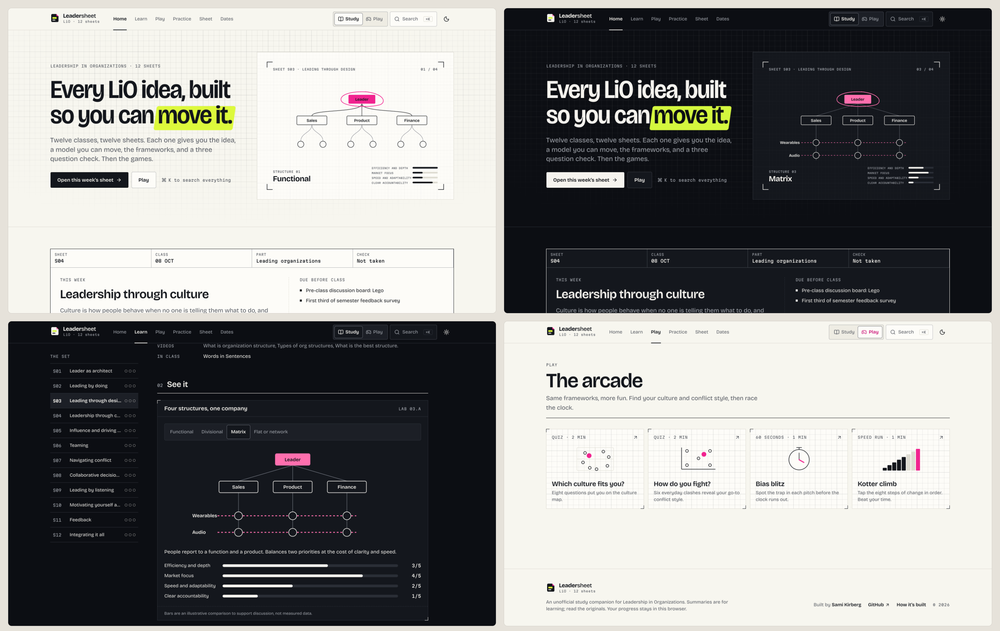

# Leadersheet

The cheat sheet for leading people. Every Leadership in Organizations idea as an interactive sheet: the idea, a model you can move, the frameworks, a three question check, a 16 second recap film, and an arcade of quizzes and games.

Built by [Sami Kirberg](https://github.com/skirberg). Next.js 16, React 19, Tailwind 4, shadcn/ui on Radix, Remotion Player. Static export: no server, no database, progress saved in each visitor's browser. The full stack is on the site at `/built/`.



## Run it

```bash
npm install
npm run dev
```

## Commands

| Command | What it does |
|---|---|
| `npm run build` | Writes the finished static site to `out/` |
| `npm run check` | Build, render the share card, then QA every page at 375 px and 1280 px in light and dark (crashes, overflow, axe) |
| `npm run shots` | Screenshots and preview contact sheets in `docs/` |
| `npm run brand <preset>` | Reskin the whole site with another preset in `src/brand/presets/` |
| `npm run contrast <preset>` | WCAG contrast for every color pair in a preset |
| `npm run domains a,b com,app,io` | Domain availability straight from the registries |

## Put it online

Publish this folder to a personal GitHub repository named `leadersheet` (GitHub Desktop: Add Local Repository, then Publish), then import it at vercel.com/new under a personal Hobby team. Every push goes live at the same link. Keep it off the Tickerz GitHub and Vercel accounts.

## Where things live

- `src/brand/`: everything brand-specific. `presets/leadersheet` is active; `presets/drafting` is the original look. How to make a new one: `docs/BRAND-KIT.md`
- `src/data/course.json`, `src/data/labs.ts`, `src/data/games.ts`: all content
- `src/components/labs/`: the 20 interactive labs
- `src/components/play/`: the arcade and the Study and Play switch
- `src/components/film/`: the Remotion hero and recap films
- `scripts/`: QA, screenshots, icons, share card, contrast, domains
- `DESIGN.md`: the reasoning behind the Leadersheet identity

Unofficial study companion. Summaries are for learning; read the originals.
